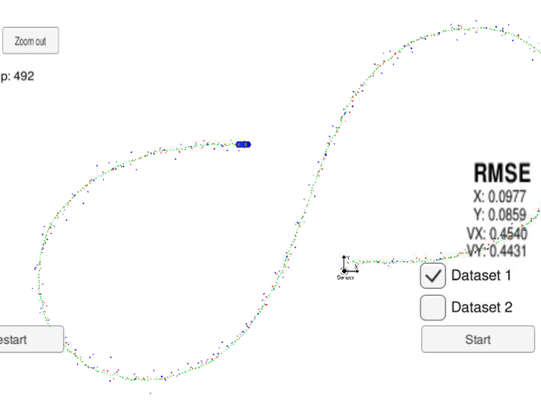
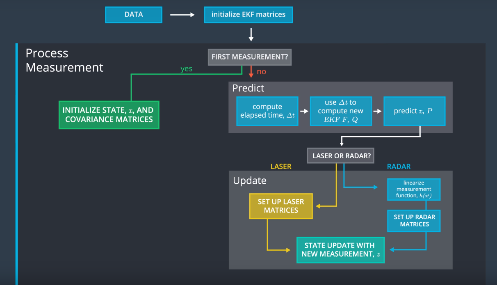
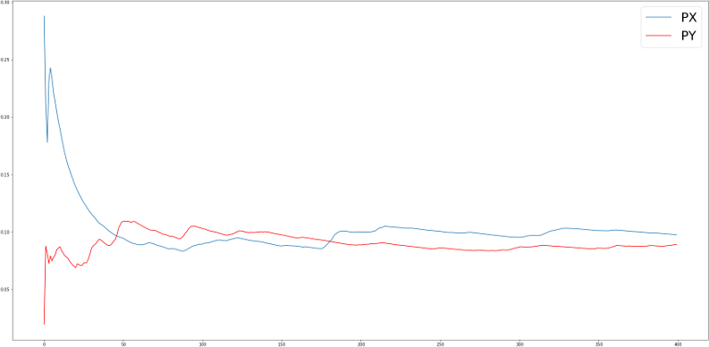
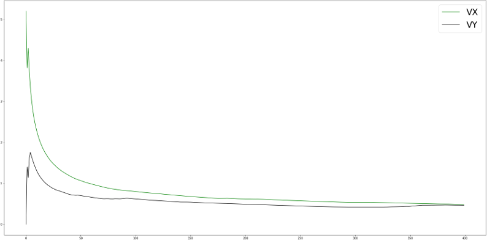
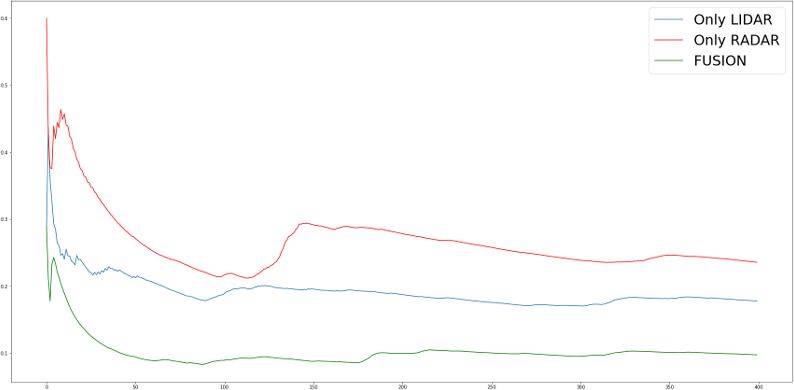
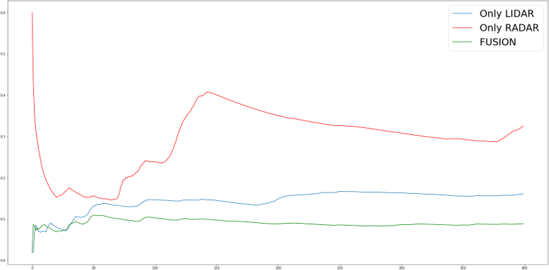
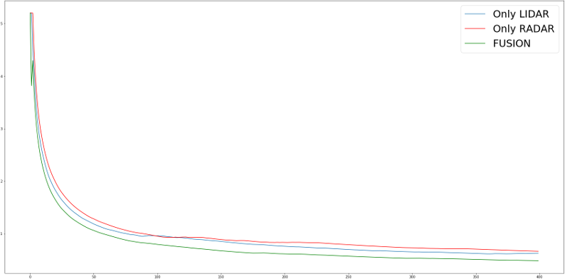
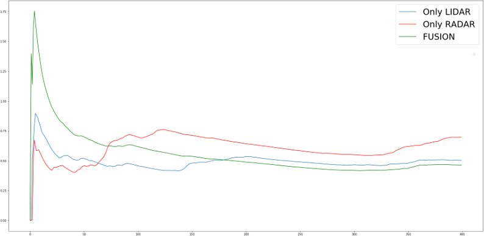

Extended Kalman Filter Project
==============================

Self-Driving Car Engineer Nanodegree Program

The goal of this project is to understand and implement an Extended
Kalman Filter. This filter will be used to predict the state of a moving
object based on simulated lidar and radar measurements. Data from
sensors are preprocessed and as an input we receive object position. As
a performance metric the root mean square error (RMSE) is used.

Overview
--------

Kalman Filter uses the system model and sensor measurements in order to
predict the state of the modelled system. The Kalman Filter represents
distributios by Gaussian and iterates on two main cycles: Measurement
Update & Motion Update (Predict).

The Extended Kalan Filter includes estimating parameters for nonlinear
system identification.

To implement the Kalman Filter we need to define: 
* State vector `x` 
In this case our state vector tracks only position and velocity, hence
acceleration is modelled as a random noise. 
* State covariance matrix `P` 
* State transition matrix `F` 
* Process covariance matrix `Q` 
It includes `Δt` to account for the fact that as more time passes, we
become more uncertain about object position and velocity. 
* Measurement matrix `H` 
* Measurement convariance matrix `R`

As it could be seen of the picture above we fuse two sensors: Lidar and
Radar.

The measurement convariance matrices for both sensors are provided as
well as noise values for process covariance matrix.

For the prediction state we use **linear** model for both cases. For the
update state for Lidar we use the regular Kalman filter equation. For
Radar we use EKF equations. The radar sensor will output values in polar
coordinates. So we need to convert x' to polar coordinates. Also angle
normalization between −π and π have to be done.

Details About Project Files
---------------------------

The source files were copied from Udacity repository:
<a href="https://github.com/udacity/CarND-Extended-Kalman-Filter-Project" class="uri">https://github.com/udacity/CarND-Extended-Kalman-Filter-Project</a>

The main file was modified in order to read data from
`obj_pose-laser-radar-synthetic-input.txt` file. The reading
functionality was overtaken from Kalman Filter lab.

Implementation of methods was added into following files: 
* `FusionEKF.cpp` 
* `kalman_filter.cpp` 
* `Tools.cpp`

After build on local machine, files were uploaded into Udacity workspace
and tested using Simulation.

### `Docs`

This folder contains input data format description.

### `data`

Contains test data.

Each row represents a sensor measurement. Detailed description is placed
in `Docs\Data_Flow_Doc.txt`.

### `CMakeLists.txt`

Contains the input to the CMake build system.

### `generate_VS_15_2_10.bat`

Script for generating Visual Studio 2015 Project setting v140 build
tools.

### `src`

Contains project source files.

#### `Eigen`

C++ template library for linear algebra:
<a href="http://eigen.tuxfamily.org/index.php?title=Main_Page#Overview" class="uri">http://eigen.tuxfamily.org/index.php?title=Main\_Page\#Overview</a>

Results & Reflection
--------------------

In this section are shown RMSE values for different scenarios:

**Position RMSE values for Fusion (Radar + Lidar) scenario**

RMSE for x and y position converts to value under .11.

**Velocity RMSE values for Fusion (Radar + Lidar) scenario**

RMSE for x and y position converts to value under .52.

#### Graphs below contain values from three different scenarios:

     * Fusion
     * Only Lidar
     * Only Radar

**X position RMSE values**

**Y position RMSE values**

**X velocity RMSE values**

**Y velocity RMSE values**

Also in the folder `results` it is possible to find recorded simulation
for fusion scenario on 1st and 2nd datasets.

Based on obtained results the fusion achieves a better level of accuracy
than prediction based only on one type of sensor.

As future work it would be also intresting to try the Unscented Kalman
Filter (UKF), which is using a deterministic sampling approach.

Also it would be beneficial to add more sensors, e.g. camera, FRR, SRR
and another type of Lidar. And find the balance between better
prediction and the process speed.

Additional sources
---------------------------

http://home.wlu.edu/~levys/kalman_tutorial/
http://biorobotics.ri.cmu.edu/papers/sbp_papers/integrated3/kleeman_kalman_basics.pdf
